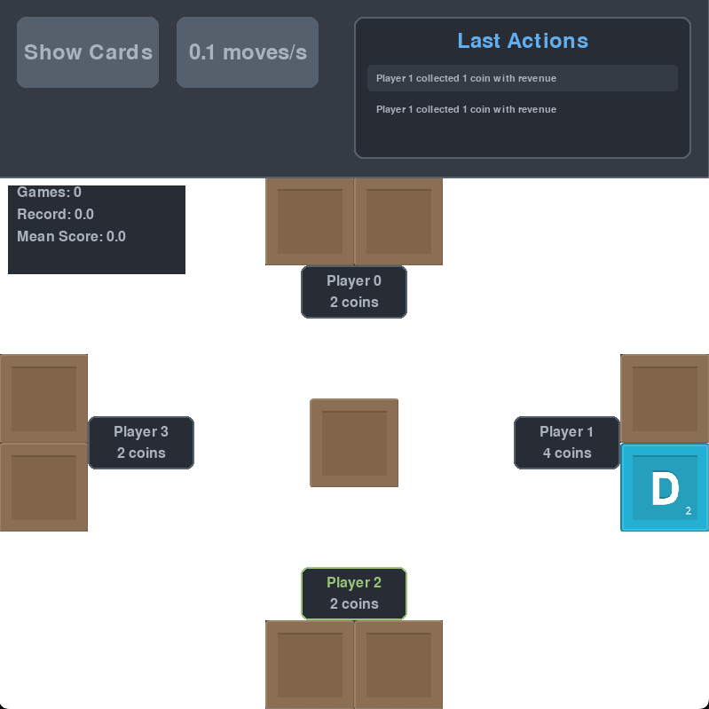

# Coup - AI Learning Simulation

A Python implementation of the board game "Coup" using Pygame, with AI agents learning through reinforcement learning. This project simulates the game mechanics and provides a visual interface to watch AI agents play and learn the game strategies.



## Features

- Full implementation of Coup game mechanics
- Visual game interface using Pygame
- AI agents using reinforcement learning
- Real-time visualization of game state
- Adjustable simulation speed
- Training statistics display
- Card reveal functionality for debugging
- Card assets from [KenneyNL](http://kenney.nl/)

## Prerequisites

- Python 3.12 or higher
- [uv](https://github.com/astral-sh/uv) package manager

## Installation

1. Clone the repository:
```bash
git clone https://github.com/yourusername/coup-pygame-rl.git
cd coup-pygame-rl
```

2. Create and activate a virtual environment using uv:
```bash
uv venv
source .venv/bin/activate  # On Unix/macOS
# or
.venv\Scripts\activate  # On Windows
```

3. Install dependencies using uv:
```bash
uv pip install .
```

## Running the Simulation

To start the simulation:

```bash
python src/simulation.py
```

## Game Controls

- **Show/Hide Cards**: Toggle to reveal or hide all player cards
- **Speed Control**: Adjust the simulation speed (0.1 to 10 moves per second)
- **Start Game**: Begin a new game simulation
- **New Game**: Start a fresh game after one ends

## Project Structure

```
coup-pygame-rl/
├── assets/           # Game assets (card images)
├── src/             
│   ├── agent.py     # AI agent implementation
│   ├── board.py     # Game board logic
│   ├── card.py      # Card class implementation
│   ├── character.py # Character types
│   ├── deck.py      # Deck management
│   ├── player.py    # Player class implementation
│   └── simulation.py # Main game loop and visualization
├── pyproject.toml   # Project dependencies
└── README.md
```

## Dependencies

- pygame (2.6.1+): Game engine and visualization
- numpy (2.3.2+): Numerical computations
- torch (2.8.0+): Machine learning framework
- pydantic (2.11.7+): Data validation

## License

This project is licensed under the terms of the LICENSE file included in the repository.

## Contributing

Contributions are welcome! Please feel free to submit a Pull Request.
